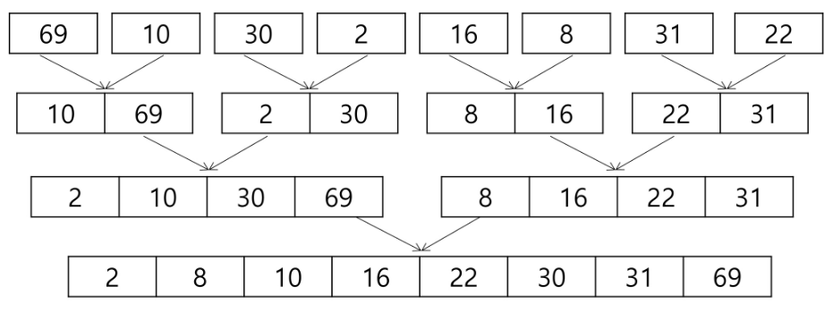

# Merge Sort
효율적인 정렬 알고리즘의 일종

대표적인 divide & conquer 알고리즘.

## 알고리즘


```python
def merge_sort(l, r):
    if l == r:
        return deque([arr[l]])
    else:
        mid = (l+r) // 2
        left = merge_sort(l, mid)
        right = merge_sort(mid+1, r)
        result = deque()
        while left and right:
            if left[0] < right[0]:
                result.append(left.popleft())
            else:
                result.append(right.popleft())
        if left:
            result.extend(left)
        else:
            result.extend(right)
        return result


arr = [2, 5, 1, 8, 20, 30, 0, 500, 20, 435, 206, 201, 206, 502]
```