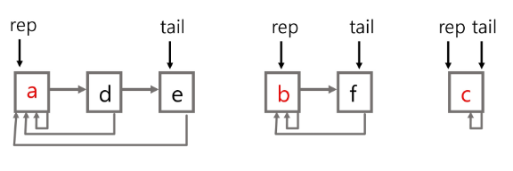
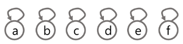
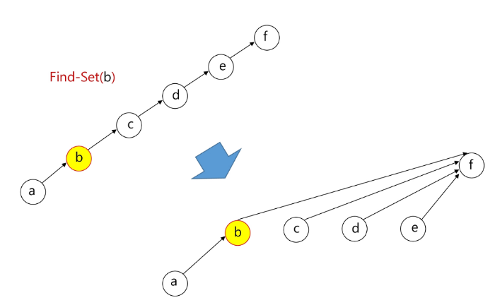

# Disjoint set
## 개요
Disjoint set은 다음을 만족하는 집합이다.
$$
\text{if X, Y are disjoint sets then } X \cap Y = \varnothing
$$
그렇다면 Disjoint set을 프로그래밍 언어로 어떻게 표현할 수 있을까?

각 집합의 대표 요소를 선택하고 그 요소를 사용해서 set을 표현한다.

아래와 같이 포인터 연산을 사용하면 disjoint set을 구현할 수 있다.



이렇게 작성할 경우, 각 원소가 어떤 집합에 속하는 지는 ref node를 바탕으로 판별할 수 있다.

이제 프로그래밍 언어별로 작성되는 코드를 알아보자.

## Python
Python에서는 포인터 연산을 명시적으로 사용하지 않는다.

따라서 부모 노드를 추적하는 parents 배열을 활용한다.

Python에서 사용되는 코드는 아래와 같다.

### 1. make_set
make_set 함수는 disjoint set을 형성하는데 필요한 값들을 초기화하는 역할을 수행한다.

각각의 값들의 부모, parents를 우선 자기자신으로 초기화한다.

그리고 값들의 rank(해당 node를 root로 하는 subtree의 height)를 0으로 초기화한다.




### 2. find_set
이 함수는 공통적으로 특정 노드의 root 노드, 다시 말해 어떤 set에 속하는지 알아내는 함수이다.

이때, 불필요한 경로가 길어지면 find_set을 수행하는데에 걸리는 시간이 길어진다. (아래와 같은 경우를 생각해 보자.)

find_set을 수행하는 과정에서 이러한 경로를 합쳐줄 수 있는데, 이를 경로 압축(path compression)이라 한다.




#### Iteration
반복문을 사용해서 root, 즉 ref_node를 찾아가는 방식이다.

부모를 반복적으로 참조하면서 ref_node를 찾는다.

이때, 현재보고 있는 노드의 부모를 부모의 부모로 바꾸어준다.

완벽한 path compression을 수행하지는 못하나, path를 대략 절반으로 줄이는 효과가 있다.

#### recursion
재귀를 통해서 ref_node를 찾아가는 방식이다.

재귀를 통해서 호출을 반복하되, 현재 노드의 parent를 재귀 함수의 반환 값으로 설정하도록 코드를 작성한다.

이렇게 작성할 경우 end condition, `x == parents[x]`에 해당하는 root값이 parent로 설정된다.

이 코드는 Iteration과 다르게 경로상의 모든 노드들의 parent를 root로 변경한다.

### 3. uinon
#### No rank
rank를 사용하지 않는 경우에는 단순히 대푯값이 작은 집합에 큰 집합을 붙여준다.

`parent[max(x_ref, y_ref)] = min(x_ref, y_ref)`

즉, 큰 쪽의 parent를 작은 쪽으로 설정하여 subtree로 설정한다.

#### Rank
rank를 사용하는 경우에는 ranks 배열에서 x, y 집합의 height를 가져온다.

이후에 rank를 비교하여 큰 쪽에 작은 쪽을 붙여준다.
(작은 쪽의 ref_node의 parent를 큰 쪽의 ref_node로 설정.)

이렇게 하면 rank가 변하지 않는다.

단, rank가 같을 경우에는 어디 붙여도 상관 없으나, subtree가 붙은 ref_node의 rank가 1 증가한다.
```python
# 1. make set
def make_set(num_sets):
    p = [i for i in range(num_sets+1)]
    r = [0 for i in range(num_sets+1)]
    return p, r


# 2.find set
def find_set_iteration(x):
    while x != parents[x]:
        # move cursor to its parent
        parents[x] = parents[parents[x]]
        # compression
        x = parents[x]
    return x


def find_set_recursive(x):
    if x == parents[x]:
        return x
    # compression & recursive call
    parents[x] = find_set_recursive(parents[x])
    return parents[x]


# 3. union set
def union(x, y):
    x_ref = find_set_recursive(x)
    y_ref = find_set_recursive(y)
    # case1. x_ref < y_ref
    # x_ref가 y_ref보다 작기 때문에 x_ref에 y_ref를 붙여줘야함.
    # 즉, y_ref의 parent를 x_ref로 업데이트.
    # case2. x_ref > y_ref
    # x_ref의 parent를 y_ref로 업데이트
    if x_ref < y_ref:
        parents[y_ref] = x_ref
    elif x_ref > y_ref:
        parents[x_ref] = y_ref


def union_rank(x, y):
    x_ref = find_set_recursive(x)
    y_ref = find_set_recursive(y)
    x_ref_rank = ranks[x_ref]
    y_ref_rank = ranks[y_ref]
    if x_ref_rank < y_ref_rank:
        parents[x_ref] = y_ref
    elif x_ref_rank > y_ref_rank:
        parents[y_ref] = x_ref
    else:
        parents[x_ref] = y_ref
        ranks[y_ref] += 1


parents, ranks = make_set(10)

```