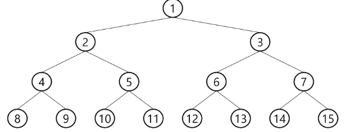
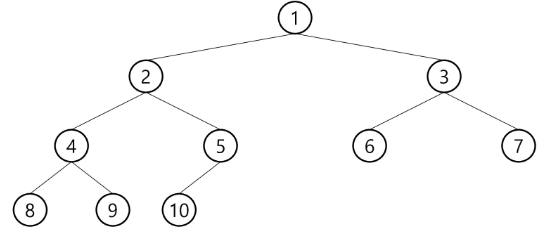
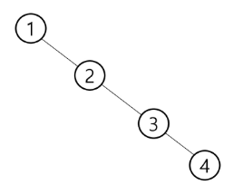

# Binary Tree
## 개요
차수가 2 이하인 트리.

각 노드는 최대 2개의 자식 노드를 갖는다.

## 이진 트리의 종류
### 포화 이진 트리
모든 레벨에 노드가 포화 상태로 채워져 있는 이진 트리.

높이가 h 일 때, 최대의 노드 개수인 $2^{h+1}-1$의 노드를 가진다.

### 완전 이진 트리
높이가 h이고 노드수가 n개일 때, 포화 이진 트리의 노드 번호 1 ~ n 번까지 빈자리가 없는 이진 트리.

### 편향 이진 트리
왼쪽 혹은 오른쪽 자식 노드만을 가진 이진 트리.

## 순회 방법
순회 방법에는 다음의 3가지 방법이 있다.
#### 1. 전위 순회
cur_node -> left -> right

#### 2. 중위 순회
left -> cur_node -> right

#### 3. 후위 순회
left -> right -> cur_node

## 특성
- 높이가 h인 이진 트리의 노드 수는 다음을 만족한다.
$$
h+1 \leq \text{number of nodes} \leq 2^{h+1}-1
$$

- 노드수가 N개인 이진 트리의 높이는 다음을 만족한다.
$$
\log{N} \leq h \leq N-1
$$