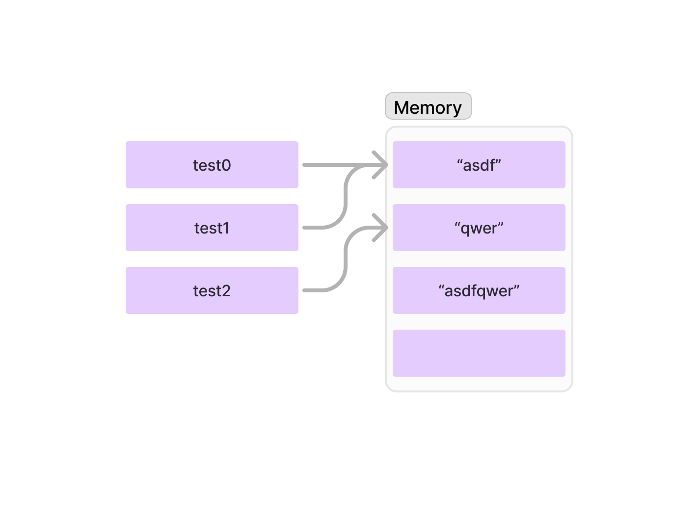

# PYTHON MEMORY
**이 문서에서는 파이썬의 memory 관리에 대해 기술합니다.**
## 개요
- PYTHON에서 변수를 할당하는 것은 메모리 상의 객체를 지정하는 메모리 주소를 변수에 저장함을 의미한다.
```python
# Fig 1
test0 = "asdf"
test1 = "asdf"
test2 = "qwer"
# Fig 2
id(test0) == id(test1) # True
id(test0) == id(test2) # False
test1 += test2
id(test0) == id(test1) # False
```



- float은 memory를 새로 할당한다.
```python
num1 = 1.5
num2 = 1.5
id(num1) == id(num2) # false
```