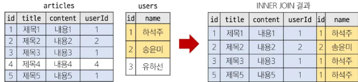
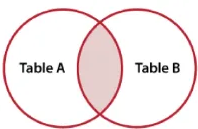
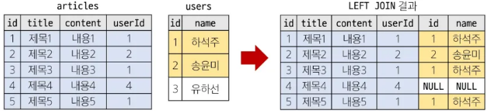
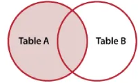

# JOIN
## INNER JOIN
Basic syntax
```SQL
SELECT * FROM main_table
INNER JOIN sub_table
ON main_table.fk = sub_table.pk
```

Example
```SQL
SELECT articles.title, users.name FROM articles
INNER JOIN users
ON articles.userId  = users.id
WHERE users.id = 1;
```





## LEFT JOIN
Basic syntax
```SQL
SELECT * FROM articles
LEFT JOIN users ON users.id = articles.user.Id
```

Example
```sql
SELECT users.name FROM users
LEFT JOIN articles
ON articles.userId = users.id
WHERE articles.userId IS NULL;
```


