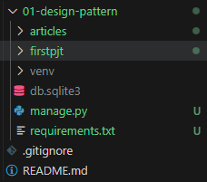

# Django - workflow
Django를 활용하여 프로젝트를 만들때, 작업 흐름은 어떻게 될까?

## 목차
#### I. 요약
#### II. 가상 환경 설정
#### III. Django
#### IV. 앱 생성과 등록
#### V. 요청과 응답 처리 

## I. 요약

1. 가상환경 생성 
2. django를 비롯한 package 설치
3. django 프로젝트 시작.
4. `python manage.py runserver`를 통해 서버가 실행되었는 지를 확인.
5. 앱을 생성하고 등록하기.
6. url.py -> views.py -> templates 순으로 작업.

### 1~3.
```bash
python -m venv venv
pip install django
pip freeze > requirements.txt
django-admin startproject firstpjt
```

## II. 가상 환경 설정
1. 가상 환경 생성
```bash
python -m venv venv
```

2. 가상 환경에서 필요한 파일들 설치
```bash
pip install packages
```

장고 설치는 다음과 같이 한다.
```bash
pip install django
```

3. git ignore 파일 작성
    - 일반적으로 .venv 파일을 ignore에 추가.

4. requirements.txt
venv 업로드 할 생각이 없기 때문에... 필요한 패키지를 알려줘야한다.
```bash
pip freeze > requirements.txt
```

반대로 requirements를 설치하기 위해서는 아래의 코드를 실행한다.
```bash
pip install -r requirements.txt
```

5. 가상 환경 종료
`deactivate`

## III. django
1. Django 시작하기
```bash
django-admin startproject firstpjt .
```
- `django-admin startproject` : django 프로젝트 생성합니다.
- `firstpjt .` : 프로젝트의 이름을 firstpjt로, firstpjt 폴더가 생성될 root dir을 현재 경로로 설정합니다.
- `.`을 마지막에 안붙이면 firstpjt 폴더 안에 firstpjt 폴더와 manage.py가 생성된다.
    - 즉, 여러 프로젝트의 하나의 가상 환경에서 작업하려면 이쪽이 유리하다.
    - 다만, manage.py에 접근하는 명령어가 길어지는 문제가 있다.

2. Django 서버 시작하기
```bash
python manage.py runserver
```
- `python manage.py` : manage.py 파일을 실행합니다.
- `runserver` : 인자로 runserver를 줍니다.

## IV. 앱 생성 및 등록
1. 앱 생성
```bash
python manage.py startapp articles
```
- `python manage.py` : manage.py 파일을 실행합니다.
- `startapp` : 앱을 생성하라는 커맨드
- `articles` : 앱의 이름은 articles.

실행을 완료하면, root dir에 `articles` 폴더가 생성된다.



2. 앱 등록
생성한 프로젝트, firstpjt에 앱의 존재를 알려줘야 합니다.

firstpjt > settings.py > INSTALLED_APPS list의 가장 앞에 `'articles', `를 작성합니다.

```python
INSTALLED_APPS = [
    'articles',
    'django.contrib.admin',
    'django.contrib.auth',
    'django.contrib.contenttypes',
    'django.contrib.sessions',
    'django.contrib.messages',
    'django.contrib.staticfiles',
]
```


## V. 요청과 응답 처리
### 1. url 파일
- app 폴더의 urls.py 파일에서 urlpatterns list에 path를 작성한다.

`path('app_name/', views.func_name)`

- 이때, 호출할 views의 함수를 전달해줘야 하므로, `from app_name import views`를 통해 package를 import 한다.


```python
"""
URL configuration for firstpjt project.

The `urlpatterns` list routes URLs to views. For more information please see:
    https://docs.djangoproject.com/en/4.2/topics/http/urls/
Examples:
Function views
    1. Add an import:  from my_app import views
    2. Add a URL to urlpatterns:  path('', views.home, name='home')
Class-based views
    1. Add an import:  from other_app.views import Home
    2. Add a URL to urlpatterns:  path('', Home.as_view(), name='home')
Including another URLconf
    1. Import the include() function: from django.urls import include, path
    2. Add a URL to urlpatterns:  path('blog/', include('blog.urls'))
"""
from django.contrib import admin
from django.urls import path
from articles import views

urlpatterns = [
    path('admin/', admin.site.urls),
    path('articles/', views.index),
]
```

### 2. views 파일
url.py 파일에서 작성한 views의 함수명을 그대로 app_name/views.py에 작성한다.

인자로 무조건 request를 받는 함수여야 한다.

render 함수에 request와 html 파일의 경루를 전달해준다.

html 파일의 경로는 templates 단의 내용을 참조한다.

정리하면, 아래와 같이 render 함수를 작성한다.

`render(request, templates_path)`

```python
from django.shortcuts import render

# Create your views here.
def index(request):            # client의 main 페이지를 응답.
    # 메인 페이지가 담겨있는 응답 객체를 반환
    return render(request, 'articles/index.html')

```

### 3. templates
다른 파일은 모두 시작하면 만들어지지만, app 폴더 내에 templates 폴더는 별도로 생성되지 않는다.

따라서 app 폴더 내에 templates 폴더를 만들고 해당 폴더 안에서 작업한다.

templates 폴더 내부의 구조는 어떻게 해도 상관 없지만, templates 폴더는 무조건 동일한 명칭으로 작성해야한다.