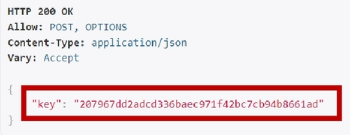
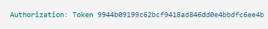

# DRF Authentication with Token Authentication
## setup
### Dj-Rest-Auth
0. pip 설치
`pip install dj-rest-auth`

1. settings.py 설정
```python
# settings.py
INSTALLED_APPS = (
    ...,
    # rest framework
    'rest_framework',
    'rest_framework.authtoken',
    # dj_rest_auth
    'dj_rest_auth',
    ...,
)
```

2. `urls.py`
```python
# pjt urls.py
urlpatterns = [
    ...,
    path('accounts/', include('dj_rest_auth.urls')),
]
```

### Dj-Rest-Auth Registration
0. pip 설치
`pip install dj-rest-auth[with-social]`
1. `settings.py`
```python
INSTALLED_APPS = [
  ...,
  'django.contrib.sites',
  'allauth',
  'allauth.account',
  'allauth.socialaccount',
  'dj_rest_auth.registration',
  ...,
]

SITE_ID = 1

MIDDLEWARE = [
  ...,
  'allauth.account.middleware.AccountMiddleware',
]
```
2. `urls.py`
```python
urlpatterns = [
  path('accounts/signup/', include('dj_rest_auth.registration.urls')),
]
```
3. `Migrate`
`python manage.py migrate`

## Use
- login 요청을 보내면, token 정보 응답.


- 로그인이 필요한 페이지로 요청을 보낼 때 headers에 전달.
- Authorization : Token {token}



## Authentication / Permission 구현
### Global setting - `settings.py`
- REST_FRAMEWORK dictionary에 사용할 AUTHENTICATION을 정의.
- Token authentication, Basic authentication, Session authentication ...
```python
REST_FRAMEWORK = {
    # Authentication - TokenAuthentication을 사용.
    'DEFAULT_AUTHENTICATION_CLASSES': [
        'rest_framework.authentication.TokenAuthentication',
    ],
    # Permission - AllowAny : 기본적으로 접근을 허용.
    'DEFAULT_PERMISSION_CLASSES': [
        'rest_framework.permissions.AllowAny',
    ],
}
```

### View function 별 설정
- Decorator를 활용.
```python
# permission Decorators
from rest_framework.decorators import permission_classes
from rest_framework.permissions import IsAuthenticated, IsAuthenticatedOrReadOnly

from django.shortcuts import get_object_or_404, get_list_or_404

from .serializers import ArticleListSerializer, ArticleSerializer
from .models import Article

# authentication_classes : 인증 방식이 다양하게 존재하는 pjt에서 인증 방식을 관리.
# permission_classes : 권한을 확인하는 용도로 사용하는 decorator
@api_view(['GET'])
@authentication_classes([SessionAuthentication, BasicAuthentication])
@permission_classes([IsAuthenticated])
def example_view(request, format=None):
    content = {
        'user': str(request.user),  # `django.contrib.auth.User` instance.
        'auth': str(request.auth),  # None
    }
    return Response(content)
```


# DRF customization
## Custom serializer
```python
# accounts/serializers.py
from dj_rest_auth.registration.serializers import RegisterSerializer

class CustomRegisterSerializer(RegisterSerializer):
    email = None  # email 필드 제거

```

```python
# settings.py
REST_AUTH = {
    'REGISTER_SERIALIZER': 'accounts.serializers.CustomRegisterSerializer',
}
```