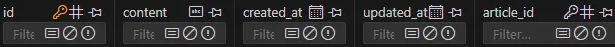

# FK
Django에서 외래 키, Foreign key를 작성하는 방법.

## 1. Models.py
외래키의 이름은 참조할 CLASS의 이름 소문자로 작성한다.

단, User model을 참조하는 필드의 경우 settings.AUTH_USER_MODEL을 사용한다. `get_user_model()`은 models.py를 제외한 파일에서 user model을 참조할 때 사용하고 settings.AUTH_USER_MODEL은 models.py에서만 사용한다.

| 항목             | `get_user_model()`                   | `settings.AUTH_USER_MODEL`       |
|------------------|--------------------------------------|----------------------------------|
| 반환값           | User 객체 (클래스)                   | 문자열 (예: `'myapp.CustomUser'`) |
| 사용처           | `models.py` **제외** 모든 곳         | `models.py` 내부에서 사용         |


```python
class Comment(models.Model):
    article = models.ForeignKey(Article, on_delete=models.CASCADE)
    user = models.ForeignKey(settings.AUTH_USER_MODEL, on_delete=models.CASCADE)
```
- 인자 분석
    - `Article` : 참조할 모델 클래스.
    - `on_delete` : 참조하는 모델이 삭제 되었을 때 해당 record를 어떻게 처리할 지 지정.
        - `models.CASCADE` : 게시글이 삭제되면 연관되는 댓글도 모두 삭제.

이후 makemigrations, migrate를 수행.



`article_id`와 같은 형태로 저장된다. (`필드명_id`)

## 2. FK 할당 및 참조
fk 할당은 table에 있는 `테이블_id`에 해당 테이블의 pk를 직접 할당하기 보다는 instance를 아래와 같이 할당한다.
```python
comment.article = article
```

참조는 다음과 같이 수행할 수 있다.
```python
comment.article
```

## 3. 역참조
역참조는 아래와 같이 수행할 수 있다.

```python
article = Article.objects.get(pk=pk)
article.comment_set.all()
```

## 4. 활용
views.py에 작성하는 로직은 CRUD와 동일하게 작성할 수 있다.

### 댓글 생성 로직
```PYTHON
def comments_create(request, article_pk):
    # 어떤 게시글에 작성되는 댓글인지 알기 위해 게시글 조회
    article = Article.objects.get(pk=article_pk)
    # CommentForm 활용한 댓글 생성
    comment_form = CommentForm(request.POST)
    if comment_form.is_valid():
        comment = comment_form.save(commit=False)
        comment.article = article
        comment.save()
        return redirect('articles:detail', article.pk)
    comments = article.comment_set.all()
    context = {
        'article' : article,
        'comments' : comments,
        'comment_form' : comment_form,
    }
    return render(request, 'articles/detail.html', context)
```

### 댓글 삭제 로직
```python
def comments_delete(request, article_pk, comment_pk):
    if request.method == 'POST':
        comment = Comment.objects.get(pk=comment_pk)
        comment.delete()
    return redirect('articles:detail', article_pk)
```
댓글 삭제를 수행할 때 redirect를 위한 article_pk를 `comment.article.pk`를 사용하여 찾을 수도 있다.
그러나 이는 다음의 이유로 권장되지 않는다.

1. urlpattern의 일관성
아래와 같이 url의 시작이 `<int:article_pk>/`로 통일되는 효과가 있다.

```python
urlpatterns = [
    path('', views.index, name='index'),
    path('<int:pk>/', views.detail, name='detail'),
    path('create/', views.create, name='create'),
    path('<int:pk>/delete/', views.delete, name='delete'),
    path('<int:pk>/update/', views.update, name='update'),
    path('<int:article_pk>/comments/', views.comments_create, name='comments_create'),
    path('<int:article_pk>/comments/<int:comment_pk>/comments/delete/', views.comments_delete, name='comments_delete'),
]
```
2. view 로직의 단순화
    - `comment.article.pk`를 수행할 필요가 없으므로, view 함수가 간결해지는 효과가 있다.
