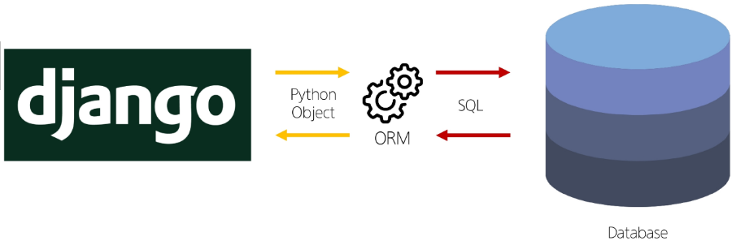
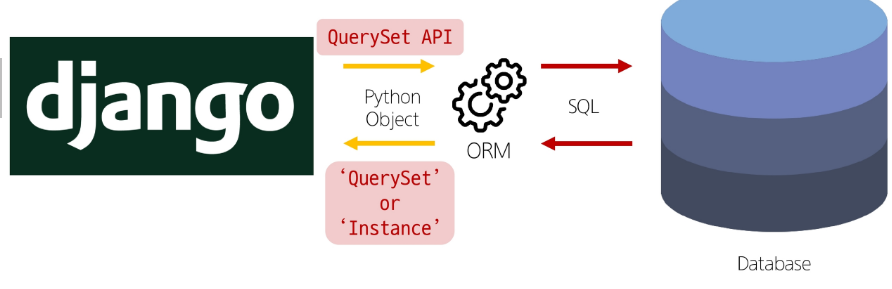

# ORM (Object Relational Mapping)

## 개요
DB에 대한 객체 지향적 접근방법.

django는 QuerySetAPI를 통해 query를 보내고 응답 받는다.



django에서 python 객체 형태로 요청을 보내면 ORM이 SQL로 전환하여 DB에 전달한다.

마찬가지로, DB에서 SQL을 ORM에 전달하면 Python 객체로 전환하여 django에 전달한다.

## CRUD
CREATE, READ, UPDATE, DELETE의 약자로, DB에 접근하고 조작하는 방법이다.



django에서 CRUD는 아래 문법을 따른다.

```python
# ModelClass.manager.QuerysetAPI
Article.objects.all()
```
### CREATE
#### 1. instance의 save method 사용
```python
article = Article()
article.title = 'first'
article.content = 'django'
article.save()
```

```python
article = Article(title='second', content='django')
article.save()
```

#### 2. Article.objects 사용
```python
Article.objects.create(title='third', content='django')
```

### READ
QuerySet API에서 지원하는 method를 사용하여 DB에서 record를 객체 형태로 가져오는 것.

**__참고__**

- Django QuerySets API에 관한 method, 용례등을 정리한 공식 문서 : 
[Django QuerySets API](https://docs.djangoproject.com/en/5.1/ref/models/querysets/#id4)

- Django에서 query를 보내는 예제 문서 : 
[Django making queries](https://docs.djangoproject.com/en/5.1/topics/db/queries/)


Field lookup을 적용하면 get, filter, exclude와 같은 API method에 조건을 좀 더 구체적으로 작성할 수 있다.

예를 들어, `title__contains = '123'`와 같이 title에 123이 포함된 record를 가져올 수 있다.

#### 1. all
용례 : `Article.objects.all()`

반환값 : `<QuerySet object>`

Table의 모든 tuple(record)를 반환.

#### 2. filter
용례 : `Article.objects.filter(title='first')`

반환값 : `<QuerySet object>`

Table에서 특정 조건을 만족하는 모든 tuple을 반환.

Field lookups를 사용하면 조건을 좀 더 구체적으로 

#### 3. get
용례 : `Article.objects.get(pk=1)`

반환값 : `<QuerySet object>`

Table에서 특정 조건을 만족하는 하나의 tuple을 반환.

만약 1개 이상의 record가 있거나 0개의 record가 있다면 error가 발생한다.

기본적으로 pk를 바탕으로 특정 값을 찾을 때 사용하는 것이 권장된다.

### UPDATE
READ를 통해서 값을 가져와서 해당 값을 변경하는 것.

```python
article = Article.object.get(pk=1)
article.title = 'hihi'
article.save()
```

### DELETE
마찬가지로 특정 값을 삭제하는 방법.

```python
article = Article.object.get(pk=2)
article.delete()
```
