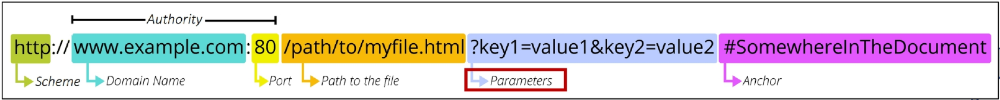
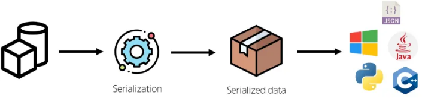

# REST API
REST API는 자원을 정의하고 자원에 대한 주소를 지정하는 전반적인 방법을 서술한다.

API를 설계하는 소프트웨어적인 방법론.

## URI (Uniform Resource Identifier)
자원의 식별.

많이 사용되는 형태는 URL (Uniform Resource Locator).

### URL

1. Scheme
- 브라우저가 리소스를 요청할 때 사용해야 하는 규약.

2. Domain Name
- 요청 중인 웹 서버를 나타냄.
- ip 주소를 직접 사용할 수도 있지만, 외우기 어렵기 때문에 주로 Domain Name으로 사용한다.

3. Port
- 웹 서버의 리소스에 접근하는데 사용되는 기술적인 문 (Gate)
- HTTP 프로토콜의 표준 포트
    - HTTP : 80
    - HTTPS : 443
- 표준 포트만 작성 시 생략 가능.

4. Path to the file
- 리소스의 경로.
- 기존에는 실제 파일의 물리적 DIR을 나타내었지만, 오늘날은 추상적인 형태의 구조를 표현함.

5. Parameters
- 웹 서버에 제공하는 추가적인 데이터.
- '&' 기호로 구분되는 key-value 쌍 목록.

6. Anchor
- 일종의 북마크를 나타내면, 브라우저에 해당 지점에 있는 콘텐츠를 표시.
- Anchor는 서버에 전달되지 않고 브라우저에게 해당 지점으로 이동할 수 있도록 한다.

## HTTP Methods
자원의 행위.

### request
request method에는 아래의 4가지가 대표적으로 사용된다.

- GET : READ
- POST : CREATE
- PUT : UPDATE
- DELETE : DELETE

### response
1. Information responses (100 - 199)
2. __Successful responses (200 - 299)__ : 성공과 관련됨.
3. Redirection messages (300 - 399)
4. __Client error responses (400 - 499)__ : 실패의 잘못이 클라이언트에 있다.
5. __Server error responses (500 - 599)__ : 실패의 잘못이 서버에 있다.

## json
자원의 표현.

실제로 전달되는 데이터의 타입.

# REST API in django - serializer
여러 시스템에서 데이터 구조나 객체 상태를 나중에 재구성할 수 있는 포맷으로 변환하는 과정.

어떠한 언어나 환경에서도 사용할 수 있도록 하는 범용성이 목적.

