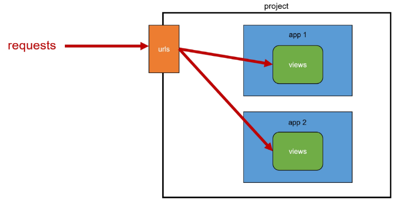
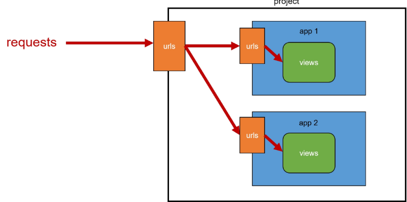
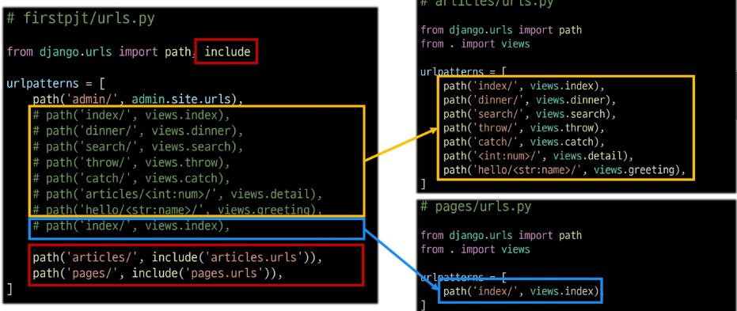

# URLs
기초적인 프로젝트 구조에서 더 나아가 좀 더 나은 프로젝트 관리 기법을 기술한다.

## Variable routing
페이지를 관리하는 것과 같이 템플릿의 많은 부분이 중복되고, URL의 일부만 변경된다면, 해당 변경되는 부분을 변수로 관리하여 작성을 간편하게 할 수 있다.

```python
urlpatterns = [
    path('articles/1/', ...)
    path('articles/2/', ...)
    path('articles/3/', ...)
    path('articles/4/', ...)
]
```

위 코드를 아래와 같이 작성할 수 있다.

```python
path('articles/<int:num>/', views.detail)
```

## APP url 정의

### 시작하기 앞서

기본적으로 프로젝트를 생성하게 되면 아래 그림과 같이 동작한다.



프로젝트의 URLs 하나로 app들의 views.py를 호출하고, 동작하게 된다.

이 경우 명칭에 문제가 발생하게 된다.

1. views를 import 하는 과정에서 서로다른 app의 views.py를 다른 이름으로 import 해야한다.
2. 프로젝트의 urls.py가 복잡해진다.

따라서 아래 같이 APP 별로 URLs.py를 작성하면 관리 및 수정이 편해진다.



### 구현

다음과 같이 코드를 수정할 수 있다.



1. project url 변경점
```python
path('pattern/', include('app_name.urls'))
path('index/', include('articles.urls'))
```

`.../index/` 형태로 reqeust가 올 경우 articles/urls.py로 요청을 넘긴다.

2. app url
`.../index/index/`의 형태로 request를 받을 경우에는 views.index를 호출한다.

다른 경로들도 마찬가지로 작동한다.


## URL naming
URL을 HTML에서 URL tag를 사용해 참조할 때, 이름을 기준으로 참조하는 방법.

```python
app_name = 'test'
urlpatterns = [
    path('index/', views.index, name='index'),
]
```

위와 같이 코드를 작성할 경우 html에서 다른 view를 호출하기 위해서 다음과 같이 url tag를 작성할 수 있다.

```
""
```

## Variable routing
주소를 변수로 선언할 수 있다. 이렇게 선언하면 해당하는 url pattern을 요청할 때에는 views.detail을 호출한다.

```python
path('todos/<int:num>/', views.detail)
```

이때 전달된 `num`은 views.detail에서 다음과 같이 사용된다.

```python
def detail(request, num):
    context = {
        'num' : num,
    }
    return render(request, 'detail.html', context)
```