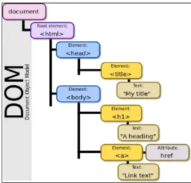

# DOM

`<p>`

DOM(Document Object Model) 웹 브라우저에서 각 태그를 객체로서 접근할 수 있도록 하는 API.

## Document
웹 페이지를 나타내는 DOM Tree의 최상위 객체.




## DOM select

인자로 css selector를 사용하여 특정 DOM을 선택하는 method.

```js
document.querySelector('.heading')
document.querySelectorAll('.content')
document.querySelectorAll('ul > li')
```

### `querySelector`
- 하나의 DOM을 선택.
- 여러 개의 태그가 조건을 만족한다면 html 문서상 가장 위의 태그를 선택.
- 만족하는 tag가 없을 경우 null을 반환.

### `querySelectorAll`
- 조건을 만족하는 모든 DOM을 선택.
- `NodeList`를 반환.
- 이때 Node List는 DOM의 변경사항을 실시간으로 반영하지 않는다.
  - DOM이 나중에 변경되더라도 이미 선택한 NodeList값은 변하지 않는다.


## DOM 조작
### Class Property
#### 1. `Element.classList.add(className)` : Element에 class 값을 추가.
#### 2. `Element.classList.remove(className)` : Element에 class 값을 삭제
#### 3. `Element.classList.toggle(className)` : Element에 class가 존재하면 제거하고 `false`를 반환. 존재하지 않으면 추가 후 `true`를 반환.


### Attribute modification
1. `Element.getAttribute(name)` : name에 해당하는 속성을 조회.
2. `Element.setAttribute(name, value)` : name에 해당하는 속성에 value 값을 지정.
3. `Element.removeAttribute(name)` : name에 해당하는 속성을 제거.

### Content text modification
Content를 조작. textContent에 값을 할당.
```js
const h1Tag = document.querySelector('h1')
h1Tag.textContent = '제목'
```

### DOM 구조 조작
#### 1. `document.createElement(tagName)`
- 해당하는 tag를 만들고 DOM을 반환. 이때 반환된 tag가 실제로 html에 반영은 되지 않음에 유의.
```js
const h1Tag = document.createElement('h1')
```

#### 2. `Node.appendChild(node)`
- Node의 child에 tag를 추가.
```js
const divTag = document.querySelector('div')
divTag.appendChild(h1Tag)
```

#### 3. `Node.removeChild(node)`
- Node의 child에서 특정 노드를 제거.
```js
const pTag = document.querySelector('p')
divTag.removeChild(pTag)
```

### Style 조작
- 조작을 할 수는 있으나, 실무적으로 많이 쓰이지 않는다.
- CSS에서 style 관련 설정을 css 파일에 별도로 작성하거나 head tag에 작성한 것과 유사.
```js
cost pTag = document.querySelector('p')
pTag.style.color = 'crimson'
pTag.style.fontSize = '2rem'
```

# 참조
## Element
- Node의 하위 유형.
- DOM에서 HTML 요소를 나타내는 특별한 유형의 Node.
- `<p>, <div>`등의 HTML 태그들이 만들어 내는 Element Node.
- Node의 속성과 메서드를 모두 가지고 있으며, 추가적으로 요소 특화 기능을 가지고 있다.
- 모든 Element는 Node이지만, 모든 Node가 Element는 아님.

## hoisting
- 변수 선언이 끌어올려 지는 현상.
- var, let, const 모두 호이스팅 되지만, let, const는 만들어지는 내부 과정이 다르므로, 이 문제를 방지할 수 있다.
- 선언한 변수가 함수 시작지점, 전역에서는 코드 시작 지점에서 처리됨.