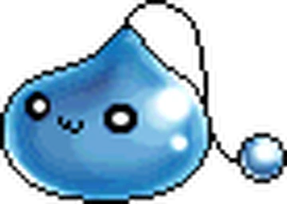
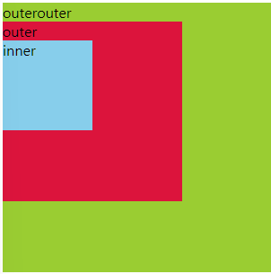

# Event
화면 스크롤, 버튼 클릭, 팝업창 출력, 커서의 위치, 키보드 입력 등의 동작들.

웹 페이지 상에서 무언가 일어났다는 신호, 또는 사건으로 DOM 요소를 이벤트와 함께 제어(`callback` 함수).

event에서 쓰이는 `callback` 함수는 event handler라고 부른다.

event handler의 첫번째 인자는 event를 받는다.

## .addEventListener()
- 이벤트가 발생 했을 때 실행할 event handler를 dom element에 등록하는 방법.

`DOMelem.addEventListener(type, handler)`

1. type : 수신할 이벤트 유형. 문자열로 작성한다.
- [MDN - event Element](https://developer.mozilla.org/en-US/docs/Web/API/Element/click_event) 
- 일반적으로 많이 쓰이는 이벤트 type 목록

| 이벤트 타입            | 설명                                         |
|------------------------|----------------------------------------------|
| `click`                | 마우스 클릭                                  |
| `dblclick`             | 더블 클릭                                    |
| `mousedown` / `mouseup`| 마우스 버튼 누르기 / 떼기                    |
| `mousemove`            | 마우스 움직임                                |
| `keydown` / `keyup`    | 키보드 키 누름 / 뗌                          |
| `input`                | `<input>`이나 `<textarea>` 값 변경될 때     |
| `change`               | `<select>`, `<input>` 등의 값이 변경될 때   |
| `submit`               | `<form>` 전송 시                             |
| `focus` / `blur`       | 포커스 얻을 때 / 잃을 때                     |
| `load`                 | 페이지나 리소스 로드 완료                    |
| `scroll`               | 스크롤 발생 시                               |
| `resize`               | 창 크기 변경 시                              |
| `touchstart`, `touchend`| 모바일 터치 이벤트                        |
| `contextmenu`          | 마우스 오른쪽 클릭 메뉴 열릴 때             |

2. handler : event가 발생했을 때 실행할 callback 함수.
- 주로 DOM 요소를 조작하는 기능을 한다.

 

## 버블링

이 버블링이 아닌데...

- 이벤트가 하위 요소에서 상위 요소로 전파되는 현상.
- html 문서는 사실 상속을 받았을 때 여러 요소가 겹쳐져 있는 형태이고 부모 객체가 자식 객체를 포함하는 형태로 구성되기 때문에, 어떤 이벤트가 자식에서 발생하면, 부모에게도 해당 이벤트가 발생하는 것은 당연한 것!

- 위와 같은 구조에서 outerouter에 handler를 지정한 경우에, inner를 클릭해도 outerouter에 이벤트가 전달되어 handler가 동작하게 된다.

### `event.target` & `event.currentTarget`
#### `target`
- 이벤트가 발생한 가장 안쪽의 요소를 참조.
- 실제 이벤트가 시작된 요소.
- 버블링과 무관하게 항상 일정함.

#### `event.currentTarget`
- 현재의 요소.
- 핸들러가 연결된 요소만을 참조.
- `this`와 같은 요소를 가리킨다.

## event 관련 property 및 method
### `event.preventDefault()`
해당 이벤트의 기본 기능을 막는다.
