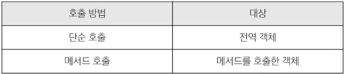

# Object
- 키로 구분된 데이터 집합을 저장하는 자료형.

## 1. 선언
- `key` - `value` 쌍으로 구성된 속성을 여러 개 작성 가능.
- `key` : 문자형만 허용.
  - 공백이 없는 경우에는 ''를 생략 가능.
- `value` : 모든 자료형 허용.
  - 함수를 선언식으로 쓸 수는 없음.
  - 표현식, Arrow functions만 가능.
```js
const uset = {
  name : 'Alice',
  func1 : function() {
    return 'hello'
  },
  func2 : () => {
    return 'hello'
  },
}
```

## 2. 기본 연산
```js
// read
user.name
user['key with space']

// add
user.address = 'korea'

// edit
user.name = 'Bella'

// delete
delete user.name

// in
console.log('address' in user)  // true
```

## 3. `this`
- 함수나 method를 호출한 객체를 가리키는 키워드.
- 함수 내에서 객체의 속성 및 method에 접근하기 위해 사용.
- `this`의 대상은 사용된 위치에 따라 다르다.


### `this` in nested functions
- `this`의 값은 arrow function일 때 다름에 유의한다.
- arrow function은 호출한 함수의 `this`를 기준으로 한다.
```js
// 1. nested with function keyword
const obj1 = {
  numbers : [1, 2, 3],
  myFunc : function() {
    this.numbers.forEach(function (number) {
      console.log(this)  // window
    })
  }
}

// 2. nested with arrow function
const obj2 = {
  numbers : [1, 2, 3],
  myFunc : function() {
    this.numbers.forEach((number) => {
      console.log(this)  // obj2
    })
  }
}
```

## 4. 추가 객체 문법
```js
// 1. 속성 단축
// user = {name : 'Alice', age : 30}
const name = 'Alice'
const age = 30

const user = {
  name, age,
}

// 2. 함수 단축
// user = {myFunc : function() {return 'Hello'}}
const obj1 = {
  myFunc() {
    return 'Hello'
  }
}

// 3. variable keys
// user = {qwerasdf : 5, zxcv : '10'}
const a = 'qwer'
const b = 'asdf'
const c = 'zxcv'
const temp = {
  [a+b] : 5,
  [c] : '10'
}

// 4. 구조 분해 할당
//   4-1) variables
// const firstNmae = userInfo.firstName
// const userId = userInfo.userId
// const email = userInfo.email
const {firstName, userId, email} = userInfo
```