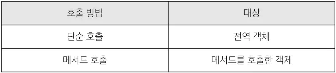

# Object
- 키로 구분된 데이터 집합을 저장하는 자료형.

## 1. 선언
- `key` - `value` 쌍으로 구성된 속성을 여러 개 작성 가능.
- `key` : 문자형만 허용.
  - 공백이 없는 경우에는 ''를 생략 가능.
- `value` : 모든 자료형 허용.
  - 함수를 선언식으로 쓸 수는 없음.
  - 표현식, Arrow functions만 가능.
```js
const user = {
  name : 'Alice',
  func1 : function() {
    return 'hello'
  },
  func2 : () => {
    return 'hello'
  },
}
```

## 2. 기본 연산
```js
// read
user.name
user['key with space']

// add
user.address = 'korea'

// edit
user.name = 'Bella'

// delete
delete user.name

// in
console.log('address' in user)  // true
```

## 3. `this`
- 함수나 method를 호출한 객체를 가리키는 키워드.
- 함수 내에서 객체의 속성 및 method에 접근하기 위해 사용.
- `this`의 대상은 사용된 위치에 따라 다르다.


### `this` in nested functions
- `this`의 값은 arrow function일 때 다름에 유의한다.
- arrow function은 호출한 함수의 `this`를 기준으로 한다.
```js
// 1. nested with function keyword
const obj1 = {
  numbers : [1, 2, 3],
  myFunc : function() {
    this.numbers.forEach(function (number) {
      console.log(this)  // window
    })
  }
}

// 2. nested with arrow function
const obj2 = {
  numbers : [1, 2, 3],
  myFunc : function() {
    this.numbers.forEach((number) => {
      console.log(this)  // obj2
    })
  }
}
```

## 4. 추가 객체 문법
```js
// 1. 속성 단축
// user = {name : 'Alice', age : 30}
const name = 'Alice'
const age = 30

const user = {
  name, age,
}


// 2. 함수 단축
// user = {myFunc : function() {return 'Hello'}}
const obj1 = {
  myFunc() {
    return 'Hello'
  }
}


// 3. variable keys
// user = {qwerasdf : 5, zxcv : '10'}
const a = 'qwer'
const b = 'asdf'
const c = 'zxcv'
const temp = {
  [a+b] : 5,
  [c] : '10'
}


// 4. 구조 분해 할당
//  4-1) variables
// const firstNmae = userInfo.firstName
// const userId = userInfo.userId
// const email = userInfo.email
const {firstName, userId, email} = userInfo

//  4-2) functions
const myFunc1 = function({name, age, city}) {
  console.log(`${name} ${age} ${city}`)
}
const myFunc2 = function({name, age}) {
  console.log(`${name} ${age} ${city}`)
}
const person1 = {'name' : 'asdf', 'age' : 3, 'city' : 'qwer',}
const person2 = {'name' : 'asdf'}
myFunc1(person1)  // asdf 3 qwer
myFunc2(person1)  // asdf 3
myFunc3(person2)  // asdf undefined


// 5. 전개 구문
const obj = {b : 2, c : 3, d : 4}
const newObj1 = {a : 1, b : 20, ...obj, e : 5}  // a : 1, b : 2, c : 3, d : 4, e : 5
const newObj2 = {a : 1, ...obj, b : 20, e : 5}  // a : 1, b : 20, c : 3, d : 4, e : 5
```


## 5. optional chaining
- object의 key가 있으면 해당 값을, 없으면 `undefined`를 반환.
- 남용은 절대 금지.
```js
user.address?.street
user.nonMethod?.()
```

## 6. json
```js
const jsObject = {
  coffee : 'Americano',
  iceCream : 'Cookie and cream'
}
// Object -> Json (string)
const objToJson = JSON.stringify(jsObject)
// Json -> Object
const jsonToObj = JSON.parse(objToJson)
```

# Array
## 1. push/pop
```js
// 1. end element
arr.push('something')
arr.pop()
// 2. start element
arr.shift()
arr.unshift('something')
```

## 2. helper methods
- arr에 대해서 많이 수행하는 작업들을 method로 만든 것.
```js
// 1. forEach : callback 함수를 각 요소에 대해 수행한다.
// 반환값 없음
arr.forEach(callback)
// 2. map : callback 함수를 각 요소에 대해 수행하고 반환 값을 각 요소로 갖는 새 배열을 반환.
const newArr = arr.map(callback)
// 3. filter : callback의 반환 값이 true인 요소만 모아서 새로운 배열을 반환.
const newArr = arr.filter(callback)
// 4. find : callback의 반환이 true이 요소를 반환.
const find = arr.find(callback)
// 5. some : callback의 반환이 true인 요소가 있으면 true / 그렇지 않으면 false
// true가 나오면 즉시 중지
const check1 = arr.some(callback)
// 6. every : callback의 반환이 모든 요소에 true이면 true / 그렇지 않으면 false
// false가 나오면 즉시 중지
const check2 = arr.every(callback)
```

# Class
- Object를 여러개 만들 경우에 매번 같은 코드를 작성하는 것은 비효율적이다.
- Class는 객체를 생성하는 템플릿 역할을 수행핸다.
- 객체의 속성, 메서드를 정의한다.
- `new` 키워드를 통해 객체를 만든다. (java와 동일함.)
- `constructor`를 선언하여 생성자를 정의해야한다.
```js
class MyClass {
  constructor(name, age) {
    this.name = name
    this.age = age
  }
  sayHi() {
    console.log(`Hi, I am ${this.name}`)
  }
}
const member = new MyClass('james', 15)

```