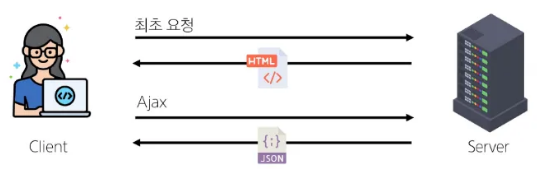

# 사전 개념

## Front-end Development
웹 사이트, app의 UI, UX를 만들고 디자인 하는 것.

HTML, CSS, JS등을 활용, 사용자가 직접 상호작용하는 부분을 개발.

## Client-side fameworks
클라이언트 측에서 UI와 상호작용하기 위해 사용되는 JS 기반 Framework.

웹에서 동적으로 처리해야할 일과 데이터가 늘어남에 따라 framework의 필요성 증가.

Angular, React, Vue, Ember등...

- 동적이고 반응적인 웹 app 개발
- 코드 재사용성 증가
- 개발 생산성 향상

## SPA(Single Page Application)
- 단일 페이지에서 동작하는 app.
- 최초 로드 시 필요한 모든 리소스 다운로드.
- 이후 갱신에 필요한 데이터만을 비동기적으로 전달 받아 화면의 일부만 동적으로 갱신.
    - AJAX와 같은 기술을 사용.
- JS를 사용, Client 측에서 동적으로 content를 생성, 업데이트.
    - CSR (Client-Side Rendering)
- MPA (Multi Page Application)과 대응되는 개념.
    - MPA는 여러개의 HTML 파일을 서버로부터 각각 로드하는 방식.

## CSR(Client-Side Rendering)
1. 최소한의 HTML 페이지와 해당 페이지에 필요한 JS를 다운로드.
2. JS를 통해 DOM을 업데이트하고 페이지를 rendering.
3. 이후 서버는 더 이상 HTML을 제공하지 않고 요청에 필요한 데이터만 응답.
- 페이지 갱신 시에 새로고침이 필요 없다!

### 장점
1. 빠른 페이지 전환
    - 서버로 전송되는 데이터의 양을 최소화.
    - 페이지가 로드된 후에는 필요한 데이터만 가져오면 됨.
2. 사용자 경험
    - 새로 고침이 발생하지 않아 native app과 유사한 사용자 경험을 제공.
3. Frontend, Backend의 명확한 분리
    - 대규모 app을 더 쉽게 개발하고 유지 관리 가능.

### 단점
1. 느린 초기 로드 속도
    - JS 다운로드에 시간이 걸리기 때문.
2. SEO (Search Engine Optimization)
    - 페이지를 나중에 업데이트하기 때문에 검색에 노출되지 않음.
    - `nuxt.js`를 사용하여 해결 가능.