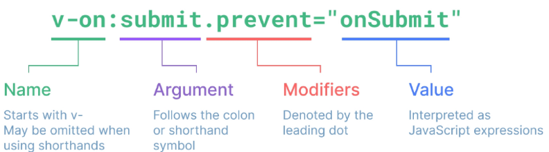

# Template Syntax
- DOM을 기본 구성 요소 instance의 데이터에 선언적으로 binding 할 수 있는 HTML 기반 템플릿 구문.

</br>

## 1. Kind of Syntax
### 1-1. Text Interpolation
```js
<p>message : {{message}}</p>
```
- data binding의 기본적인 형태.
- 이중 괄호 구문을 사용.
- `message` 속성이 변경될 때마다 업데이트 된다.

</br>

### 1-2. Raw HTML
```js
<div v-html="rawHtml"></div>

...

const rawHtml = ref('<p>안녕하세요</p>')
```
- 실제 HTML tag를 string 형태로 넣어주는 문법.
- 내부의 text Content 및 child tag들을 덮어쓴다.
- 주의 사항
    - 사용자가 입력한 값에 악성 코드가 존재할 수 있으므로, 악용될 여지가 있다.

</br>

### 1-3. Attribute Binding
```js
<div v-bind:id="dynamicId"></div>

...

const dynamicId = ref('my-id')
```
- `{{}}` 형태의 변수는 HTML 속성 내에서 사용할 수 없기 때문에 `v-bind`를 사용.
    - format string 형태로 작성은 가능하지만, 정적인 반영임.
- HTML의 `id` 속성 값을 vue의 `dynamicId` 속성과 동기화 되도록 한다.
- binding 값이 `null`, `undefined`인 경우 rendering 되지 않는다.

</br>

### 1-4. JS Expressions
```js
{{ number + 1 }}
{{ ok ? 'YES' : 'NO' }}
{{ message.split('').reverse().join('') }}

// 큰 따옴표 내부에 js 식을 작성해야함에 유의한다.
<div v-bind:id="`list-${id}`"></div>
```
- Vue는 모든 binding 내에서 JS 표현식의 모든 기능을 제공.
- JS 표현식은 `{{}}` 내부 혹은 directive (`v-`) 속성 값에 사용할 수 있다.
- 아래 문법은 사용할 수 없음에 유의한다.
```js
{{ const number = 1 }}
{{ if (ok) {return message} }}
```

</br>
</br>

## 2. Directive
- `v-` 접두사가 있는 특수 속성.
- Vue에서 인식하고 특별한 기능을 수행하도록 한다.

[Built-in Directives, Vue](https://vuejs.org/api/built-in-directives.html)

</br>

### 2-1. 개요
- Directive의 속성 값은 단일 JS 표현식이어야 한다. (`v-for`, `v-on` 제외.)
    - 표현식 값이 변경될 때 DOM에 반응적으로 업데이트를 적용.
```js
// v-if는 true인 경우 해당 태그를 rendering하고 false인 경우 하지 않는다.
<p v-if="seen">Hi There</p>
```

</br>

### 2-2. 전체 구조

1. Argument
- 일부 directive는 뒤에 `:`으로 표시되는 인자를 사용한다.
- `v-bind` : binding할 속성을 지정
- `v-on` : 수신할 이벤트를 지정
2. modifiers
- directive가 특별한 방식으로 binding 되어야 함을 나타낸다.
- `.prevent` : `event.preventDefault()`와 동일한 기능을 함.

</br>
</br>

## 3. `v-bind` (Directive, Attribute handling)
### 3-1. Attribute Bindings
1. Basic syntax
```js

<a v-bind:href="myUrl">Move to Url</a>
```

2. Shorthand
```js

<a :href="myUrl">Move to Url</a>
```

3. Function
    - 반환값이 속성으로 지정됨.

4. Variable attribute name
- key 값을 변수로 처리하는 방법.
```js
<button :[key]="value"></button>
```

</br>

### 3-2. Class binding
1. Object : value가 true인 경우 key에 해당하는 속성이 class에 추가된다.
```js
<div class="static" :class="classObj">
    Text
</div>

...

const isActive = ref('false')
const isInfo = ref('true')
const classObj = {
    active : isActive,
    'text-primary' : isInfo,
}
```
```js
<div class="static" :class="{active : isActive, 'text-primary' : isInfo}">
    Text
</div>

...

const isActive = ref('false')
const isInfo = ref('true')
```

2. Array : 배열의 각 값들을 class로 넣어준다.
```js
<div class="static" :class="[activleClass, infoClass]">Text</div>

...

const activeClass = ref('active')
const infoClass = ref('text-primary')
```

3. Nested : array에 object가 포함될 수 있다.
```js
<div class="static" :class="[{ active : isActive }, infoClass]">Text</div>

...

const isActive = ref(true)
const infoClass = ref('text-primary')
```

</br>

### 3-3. Style binding
- 기본적으로 inline styling에 해당하므로 권장되지 않는다.
- class를 통해 style을 css file으로부터 부여하자.
- class와 마찬가지로 directive 속성에는 js 문법을 사용할 수 있기 때문에, 배열이나 객체를 directive에서 정의해도 된다.
```js
<div :style="[styleObj1, styleObj2]">Text</div>

...

const styleObj1 = ref({
    coloe : 'blue',
    border : '1px solid black'
})

const styleObj2 = ref({
    color : activeColor,
    fontSize : fontSize.value + 'px'
})
```

</br>
</br>

## 4. `v-on` (Directive, Event handling)
### 4-1. Basic syntax
- Basic : `v-on:event="handler"`
- Shorthand : `@event="handler"`

</br>

### 4-2. Handlers
```js
// 1. Inline
<button @click="count++"></button>

// 2. Method
<button @click="increase"></button>
...
const increase = function() {
    count.value += 1
}

// 3. Method takes event as a first arg.
<button @click="increase"></button>
...
const increase = function(event) {
    console.log(event)
}

// 4. Method taking input
<button @click="warning('경고입니다.')">Warning</button>
...
const warning = (message) => {
    console.log(message)
}

// 5. Method with user args
// $event로 event를 넘겨준다.
<button @click="warning('경고입니다.', $event, '진짜입니다.')">Warning</button>
...
const warning = (str1, event, str2) => {
    console.log(str1)
    console.log(event)
    console.log(str2)
}
```

</br>

### 4-3. Modifiers
1. `stop` : bubbling 방지. Event가 상위 객체로 전파되는 것을 막는다.
2. `prevent` : `preventDefault()`
3. `keyup`관련 modifiers : 키보드 이벤트를 특정 키 만을 감지하도록 할 수 있다.
    `<input @keyup.enter="onSubmit">`

</br>
</br>

## 5. Form Input Bindings
`form`을 처리할 때 사용자가 `input`에 입력하는 값을 실시간으로 JS에 동기화 해야하는 경우 수행하는 양방향 바인딩.


### 5-1. `v-bind` + `v-on`
- `v-bind` : js -> html binding
- `v-on` : html -> js binding
```js
<input :value="inputText1" @input="onInput">
...
const inputText = ref('')
const onInput = (event) => {
    inputText.value = event.currentTarget.value
}
```

</br>

### 5-2. `v-model`
- 5-1의 과정을 한번에 수행.
- 다만, IME 때문에 한글의 경우 글자가 완성되어야 변수가 변경되는 문제가 있음.
```js
<input v-modl="inputText">
...
const inputText2 = ref('')
```

</br>

### 5-3. Checkbox
- check box 별로 v-model 작성
1. single checkbox
```js
<input type="checkbox" id="checkbox" v-model="checked">
<label for="checkbox">{{ checked }}</label>
...
const checked = ref(false)
```

2. multiple checkbox
```js
<input type="checkbox" id="checkbox1" v-model="checkList" value="Alice">
<label for="checkbox1">Alice</label>
<input type="checkbox" id="checkbox2" v-model="checkList" value="Bella">
<label for="checkbox2">Bella</label>
...
const checked = ref([])
```

### 5-4. Select
- select tag에 v-model 작성
```js
<div> Selected : {{ selected }}</div>

<select v-model="selected">
    <option diabled value="">Please Select One</option>
    <option>Alice</option>
    <option>Bella</option>
</select>
...
const selected = ref('')
```

### 5-5. Radio Box
- radio tag의 name 속성이 같아야 중복 설정을 막을 수 있다.
```js
<div>
    <input type="radio" name="name" id="radio1" value="Alice" v-model="radioCheck">
    <label for="radio1">Alice</label>
    <input type="radio" name="name" id="radio2" value="Bella" v-model="radioCheck">
    <label for="radio2">Bella</label>
</div>
...
const radioCheck = ref('')
```