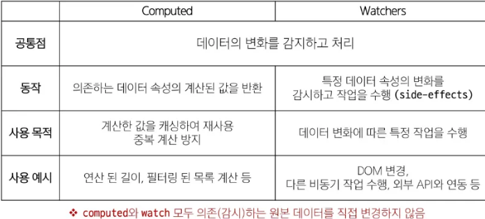
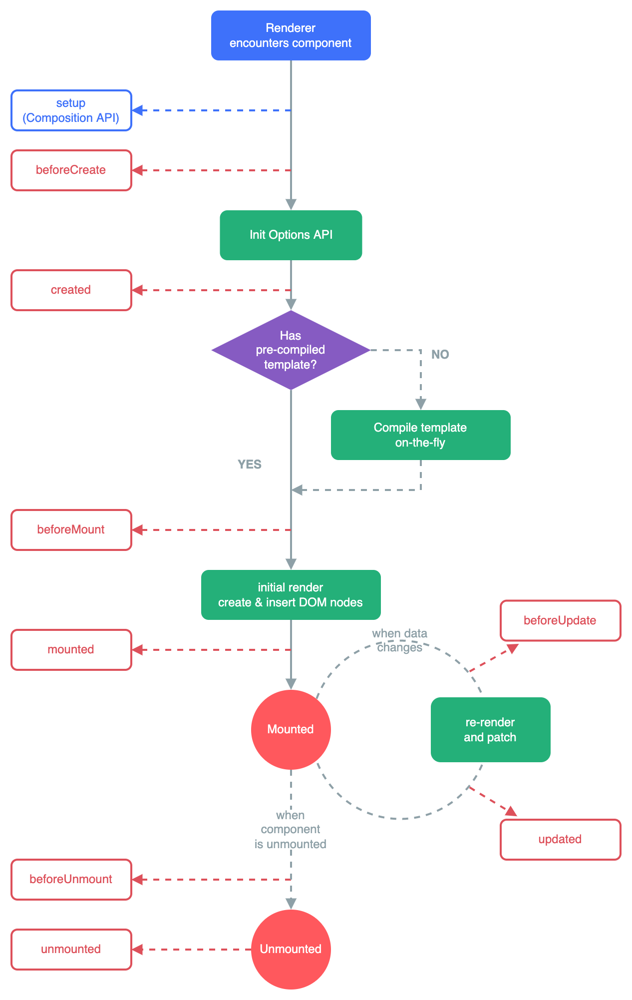

# Basic syntax2

## 1. `computed`
- 계산된 속성을 정의하는 함수.
- 결과를 캐싱하여 template에서 반복적으로 호출할 때 연산을 반복하는 것이 아니라 캐싱된 데이터를 rendering한다.
- DB에 영향을 주지 않는 데이터 전처리를 FE에서 수행할 때.
- Basic syntax
```js
const computedValue = computed(() => {
    //do something
    return calculateValue
})
```

### 예제
- 삼항 연산자를 tag에서 호출할 때마다 연산량이 증가함.
```js
const todos = ref([
    {text : 'Vue 실습'},
    {text : '자격증 공부'},
    {text : 'TIL 작성'},
])

<h2>남은 할 일</h2>
<p>{{ todos.length > 0 ? '아직 남았다' : '퇴근!'}}</p>
```

- Computed를 사용하면 한번만 연산을 수행하고 해당 값을 반복적으로 사용한다.
```js
const { createApp, ref, computed } = Vue

const restOfTodos = computed(() => {
    return todos.value.length > 0 ? '아직 남았다' : '퇴근!'
})

<h2>남은 할 일</h2>
<p>{{ restOfTodos }}</p>
```

### 특징
- 의존된 데이터를 자동으로 추적.
- 해당 데이터(변수)가 변경될 경우에 `computed`의 callback 함수가 실행된다.


## 2. `v-if`
### 개요
- 표현식의 `true`/`false`를 기반으로 요소를 조건부로 rendering.
- `v-show`와 다르게 html tag 자체를 생성했다가 없애는 기능을 제공한다.
```js
const isSeen = ref(true)

<p v-if="isSeen">true일 때 보입니다.</p>
<p v-if="!isSeen">false일 때 보입니다.</p>
<button @click="isSeen = !isSeen"></button>
```

### `else-if`, `else`
- `else-if`와 `else`는 sibling 끼리 연산된다.
- `else-if`와 `else` 사이에 다른 tag가 존재할 경우 정상적으로 동작하지 않는다.
```js
const name = ref('Cathy')

<div v-if="name === 'Alice'">Alice 입니다.</div>
<div v-else-if="name === 'Bella'">Bella 입니다.</div>
<div v-else-if="name === 'Cathy'">Cathy 입니다.</div>
<div v-else>아무도 아닙니다.</div>
```


### `v-show` vs. `v-if`
- `v-show`는 html tag는 만들지만, `display : none` style을 적용하여 가시성을 제한한다.
- 토글이 많이 일어나는 경우에는 `v-show`를 사용하고 실행 중에 조건이 변경되지 않는 경우에는 `v-if`를 사용한다.


## 3. `v-for`
### 개요
- 소스 데이터 기반으로 요소 또는 템플릿 블록을 화면에 반복적으로 rendering한다.
- `template` tag는 html에 rendering되지 않으므로 불필요한 tag 표현하지 않고 `v-for`를 작성할 수 있다.

### 구조
1. Basic
```js
<div v-for="item in itmes">
    {{ item.text }}
</div>
```

2. Naming index / key
- python과 반대로 변수가 할당된다.
```js
// 1. array
<div v-for="(item, index) in arr"></div>

// 2. object
<div v-for="value in object"></div>
<div v-for="(value, key) in object"></div>
<div v-for="(value, key, index) in object"></div>
```
- `v-for` 내부에 카드와 같은 html 구조를 작성해 두고, 값들을 변수를 통해 채우기.

3. nested for
```js
<ul v-for="item in myInfo">
    <li v-for="friend in item.friends">
        {{ item.name }} - {{ friend }}
    </li>
</ul>
```

### `:key`
- 각 항목이 서로 구분되는 고유 식별자 역할을 할 수 있는 속성을 객체에 정의하고, 해당 값을 `:key` 속성으로 태그에 작성한다.
- `number` 혹은 `string`으로만 작성해야 한다.
- Vue 내부 DOM 알고리즘이 이전 목록과 새 노드 목록을 비교할 때 각 node를 식별하는 용도로 사용한다.
```js
let id = 0

const items = ref([
    { id : id++, name:'Alice'},
    { id : id++, name:'Bella'},
])

<div v-for="item in items" :key="item.id">
</div>
```

### `v-if` 사용시 주의사항.
- 동일한 요소에 대해 `v-if`가 `v-for`보다 우선순위가 더 높기 때문에 `v-for`에서 사용하는 변수를 `v-if`에서 사용할 수 없다.
- 따라서 동일 tag에 `v-for`과 `v-if`를 함께 사용하지 않는다.
```js
// 오류 발생!
<ul>
    <li v-for="todo in todos" v-if="!todo.isComplete" :key="todo.id">
        {{ todo.name }}
    </li>
</ul>

// 해결법 1. template 요소 사용하여 for과 if를 분리하기.
<ul>
    <template v-for="todo in todos" :key="todo.id">
        <li v-if="!todo.isComplete">
            {{ todo.name }}
        </li>
    </template>
</ul>

// 해결법 2. computed를 사용하기
const filteredTodos = computed(() => {
    return todos.value.filter((todo) => !todo.isComplete)
})

<ul>
    <li v-for="todo in filteredTodos" :key="todo.id">
        {{todo.name}}
    </li>
</ul>
```

## 4. `watch`
- 하나 이상의 반응형 데이터를 감시하고, 감시하는 데이터가 변경되면 callback 함수를 호출.
- `computed`가 데이터가 변경 되었을 때 연관된 데이터를 캐싱을 통해 한번에 연산하는 목적이라면 `watch` 함수는 값에 변화가 발생했을 때 특정 로직을 실행하기 위함.
- 인자로 감시할 대상 (변수나 데이터)와 callback 함수를 받는다.
    - callback 함수는 새로운 값과 이전 값을 인자로 받는다.

### 구조
```js
// 1. Basic
watch(source, (newValue, oldValue) => {
    // dosomething
})

// 2. Multiple values
watch([foo, bar], ([newFoo, newBar], [prevFoo, prevBar]) => {
    // do something
})
```

### `computed` vs. `watch`


### 주의사항
**절대로 원본 데이터(감시하는 대상)을 직접 바꾸지 말 것!!**

**이 경우 원본 데이터의 변경이 다시 `computed` / `watch` 를 호출하여 무한루프에 빠지게 된다.**


## 5. Lifecycle Hooks
- Vue component (app...) 의 생성부터 소별까지 각 단계에서 실행되는 함수.
- 개발자가 사이클의 특정 부분에서 수행할 로직을 작성할 수 있도록 한다.
- `onMounted`, `onUpdated`, `onUnmounted`을 주로 사용한다.

```js
const { createApp, ref, onMounted, onUpdated} = Vue

setup() {
    onMounted(() => {
        console.log('mounted')
    })
}
```

