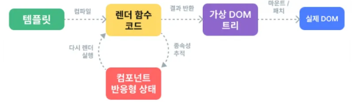

# SFC, Single File Component
## 개요
- 프로젝트 단위로 Vue 개발을 할 때 component 단위로 개발.
- 하나의 파일에는 하나의 component만이 들어간다.
    - 페이지에서 여러 개의 카드를 rendering하는 경우 카드를 하나의 component로 생각할 수 있다.
- 관련 기술
    - Vite : Vue SFC project를 위한 빌드 도구.
    - NPM, Node Package Manager : Node에서 제공하는 패키지 관리자.
    - Node.js : Chrome의 V8 JS 엔진 기반 Server-Side 실행 환경.

## 모듈, 번들러
### Module
- 프로그램을 구성하는 독립적인 코드 블록.
- app의 크기가 커지고 복잡해지면서 파일 하나에 모든 기능을 담기가 어렵다.
- 따라서 자연스럽게 파일을 여러개로 분리하여 관리하고 이때 분리된 각 파일이 하나의 모듈이다.
- `*.js` 파일 하나가 하나의 모듈이다.
### Module의 한계
- app이 점점 발전하면서 사용하는 js 파일 또한 극적으로 증가.
- 이러한 상황에서 성능 병목 현상 및 충돌 문제가 발생.
- 복잡하고 깊은 모듈간 의존성 문제를 해결하기 위한 도구가 필요. `Bundler`
### Bundler
- 의존성 관리, 코드 최적화, 리소스 관리 등.
- Bundler가 하는 작업을 Bundling이라 함.
- Vite는 Roll Bundler를 통해 기타 환경 설정을 자동으로 관리.

# Virtual DOM

- 가상의 DOM을 메모리에 저장하고 실제 DOM과 동기화 하는 프로그래밍 개념.
- 실제 DOM과의 변경사항 비교를 통해 변경된 부분만 실제 DOM에 적용하는 방식.
- 웹 APP 성능 향상을 위한 Vue 내부 렌더링 기술.
- Virtual DOM은 `div#app` 영역에서 동작.
## 장점
- 효율성 : 실제 DOM 조작을 최소화, 변경된 부분만 업데이트하여 성능을 향상
- 반응성 : 데이터의 변경을 감시하고, Virtual DOM을 효율적으로 갱신하여 UI를 자동으로 업데이트.
- 추상화 : 개발자는 실제 DOM 조작을 Vue에게 맡기고 컴포넌트와 템플릿을 활용하는 추상화된 프로그래밍 방식으로 원하는 UI 구조를 구성, 관리할 수 있다.
## 주의사항
- 실제 DOM에는 접근하지 말 것.
    - 실제 DOM이 형성되는 순간은 mount 이후이므로 `querySelector`등이 올바르게 동작하지 않는다.
- `ref` 속성과 `LifeCycle Hook`을 사용하면 접근 가능하지만, 완전한 이해가 없다면 권장하지 않는다.

# Composition API & Option API
## Composition API
- import 해서 가져온 API 함수들을 사용하여 Component Logic을 정의.
    - Vue3에서 권장하는 방식.

## Option API
- data, methods, mounted 같은 객체를 사용하여 script tag 내에서 component logic을 정의.
    - Vue2에서의 작성 방식.
    - Vue3에서도 지원.