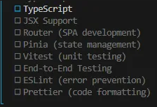

# 프로젝트 시작하기
## 관련 extension, 프로그램 설치
1. `node.js` 설치
2. `vue vscode snippets` extension 설치
    - shift + Ctrl + p
    - snippet 검색
    - vue 검색
    - 내부 파일을 아래와 같이 수정
    ```json
    "Print to console": {
        "prefix": "vue",
        "body": [
            "<template>",
            "",
            "</template>",
            "",
            "<script setup>",
            "",
            "</script>",
            "",
            "<style scoped>",
            "",
            "</style>",
        ],
        "description": "vue for ssafy"
    }
    ```
3. `vue - Official` extension 설치

## Project 시작하기
### 1. create vue project
```bash
npm create vue@latest
```

### 2. Name vue project
```bash
Project name (target directory):
    vue-project
```

### 3. Select features


### 4. npm commands
- `vue-project` 경로로 이동.
- 의존성 package 설치.
- 서버 실행하여 FE 환경 확인.
```bash
cd vue-project
npm install
npm run dev
```

### 5. 파일 초기화
- `App.vue` 파일 초기화
- components 폴더의 파일들 삭제
- assetes 폴더 내부 파일 삭제
- `main.js`의 assets import 문 삭제

### 6. 실습
0. 모든 vue 파일은 `template`, `script`, `style` tag를 작성.
    - 하나의 `<script setup>` tag를 포함.
    - `<style scoped>`로 작성하여 component 별로 스타일 작성.
1. MyComponent 파일 형성 (PascalCase로 작성.)
2. MyComponent 파일 import
```js
<template>
  <h1>App.vue</h1>
  <MyComponent />
</template>

<script setup>
	// @는 src 경로를 의미함.
  import MyComponent from '@/components/MyComponent.vue'
</script>

// scoped 속성을 할당하면 해당 component에만 style이 적용됨.
// 예외적으로 최상위 속성은 부모 vue 파일의 style을 물려받을 수 있음.
<style scoped>

</style>
```

```js
<template>
  <h2>{{ message }}</h2>
</template>

<script setup>
  import {ref} from 'vue'
  const message = ref('안녕하세요')
</script>

<style scoped>

</style>
```


# Etc
## Single Component Root
- 각 component는 하나의 tag로 감싸야 한다.
```js
// bad
<template>
	<h1>asdf</h1>
	<p>qwer</p>
</template>

// good
<template>
	<div>
		<h1>asdf</h1>
		<p>qwer</p>
	</div>
</template>
```