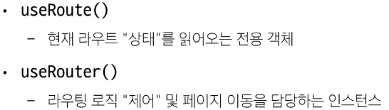

# Routing
- 네트워크에서 경로를 선택하는 프로세스.
- web Application에서 다른 page 간의 전환과 경로를 관리하는 기술.

## Routing in SSR
- SSR에서 routing은 server에서 수행.
- 적절한 HTML 응답을 전달하고, 새 HTML으로 전체 페이지를 로드.

## Routing in CSR
- CSR에서 routing은 client에서 수행.
- Client 측 JS가 새 데이터를 동적으로 가져와 전체 페이지를 로드하지 않음.

### SPA에서 routing이 없다면
- 유저가 url을 통한 페이지 변화를 감지할 수 없다.
- 새로 고침 시 처음 페이지로 되돌아감.
- 링크를 공유할 시 첫 페이지만 공유 가능.
- 브라우저의 뒤로 가기 기능을 사용할 수 없음.


# Vue route structure
- `npm create vue@latest` 실행 후 routing 옵션을 체크한 경우 아래와 같은 폴더 구조가 자동으로 생성된다.


## `router/index.js`
- Django의 `url.py`와 유사한 기능을 수행.
- url 경로와 Named, Nested routing등을 수행.

## `views`
- routing을 기반으로 부분적으로 로딩할 component들을 저장하는 폴더.
- 반드시 해당 폴더에 존재해야 할 필요는 없으나, 프로젝트의 파일 구조 관리를 위해 해당 폴더에 routing에 사용될 component를 넣는다.


# Routing methods

## Named Routing
- 경로에 이름을 지정.
- path는 변경될 수 있으나, name은 잘 변하지 않기 때문에 명시성, 유지 보수성 측면에서 강점을 가진다.

### `index.js`
- index.js에 `name`, `path`, `component`를 작성.
    - `name` : 참조에 사용할 이름
    - `path` : 사용할 경로
    - `component` : 사용할 component
```js
// index.js
const router = createRouter({
    history: createWebHistory(import.meta.env.BASE_URL),
    routes:[
    ...
    {
        path: '/',
        name: 'home',
        component: HomeView,
    },
    ...
    ]
})

export default router
```

### `App.vue`
- RouterLink에 `:to` 속성을 작성.
- Router로 표시할 부분을 `<RouterView/>` tag를 통해 작성.
```js
// App.vue
<script setup>
    import { RouterLink, RouterView } from 'vue-router'
</script>

<template>
    <nav>
        <RouterLink :to="{name : 'home'}">Home</RouterLink>
        <RouterLink :to="{name : 'about'}">About</RouterLink>
    </nav>

    <RouterView />
</template>
```

## Dynamic Routing

### `index.js`
- 동일한 pattern의 url을 반복해서 사용해야 하는 경우에 사용.
    - `user/1`, `user/2`, `user/3`, ...
- Django의 variable routing과 유사한 기능.
```js
// index.js
{
    path: 'user/:id',
    name: 'user',
    component: UserView,
}
```

### `App.vue`
- `:to` 속성의 객체에 `params` 속성을 추가로 작성.
- `params`에 `index.js`에서 사용한 변수명과 같은 키와 해당하는 변수를 객체로 전달.
```js
<RouterLink :to="{ name : 'user', params: {'id' : 1} }">User</RouterLink>
```


### `View`
- component로 전달한 vue 파일에서는 변수를 `route`를 통해 가져온다.
- template에서는 `$route.params`를 사용된다.
- script에서는 `useRoute` 함수의 반환값을 사용된다.
- `useRouter`는 programmatic navigation에 사용된다.
```js
// UserView.vue
<template>
    <div>
        <h1>User PAGE</h1>
        <h2>현재 경로에 관련된 어떤 정보들은 {{ $route.params }}가 관리하고 있음.</h2>
    </div>
</template>

<script setup>
    import { useRoute, useRouter } from "vue-router";
    const route = useRoute()
    const router = useRouter()
    console.log(route)
    console.log(router)
</script>

<style scoped>

</style>
```


## Nested Routing
- app의 UI는 여러 레벨의 깊이로 중첩된 component로 구성.
- url을 중첩된 component의 구조에 따라 변경되도록 이 관계를 표현.
    - 중첩되는 url을 `children`을 사용하여 표현.
- **Nested Routing은 부모-자식 관계가 아니라 URL에서 중첩된 관계를 표현하는 것으로 해석할 것.**


### `index.js`
```js
// index.js
{
    path: '/user/:id',
    component: UserView,
    children: [
        {path: '', name: 'user', component: UserProfile},
        {path: 'profile', name: 'user-profile', component: UserProfile},
        {path: 'posts', name: 'user-post', component: UserPosts},
    ]
}
```

### `UserView.vue`
- `children`의 다른 경로의 이동은 `RouterLink`와 `RouterView`를 사용.
- `App.vue`에서 사용했던 위의 예제와 동일.
```js
// UserView.vue
<template>
    <RouterLink :to="{ name: 'user-profile' }">Profile</RouterLink>
    <RouterLink :to="{ name: 'user-post'}">Posts</RouterLink>

    <!-- nested children info -->
    <RouterView />
</template>
```

# Route & Router




## Route
- 읽기 전용.
- url이 변경되면 route 객체도 자동으로 변경.

### 역할
- 현재 경로에 대한 정보를 확인.
    - `route.params`, `route.query`, `route.name`등을 통해 현재 페이지 상태를 확인.
    - update, create에서 form은 동일한데, 내용이 달라져야 하는 경우.
- `route` 객체 자체를 통해 페이지 이동을 직접 제어할 수는 없다.


## Router
- app 전체 routing logic을 제어.
- 페이지 이동, Navigation 관련 method를 제공.
- programmatic routing
- `@click="callBack"`을 통해 `router.push`를 호출하면 script에서 navigation을 제어할 수 있다.

### Frequently Used Methods
- `router.push({ name : path-name })` : path-name에 해당하는 경로로 이동.
- `router.replace({ name : path-name })` : web histroty stack에 추가하지 않고 이동.


### Programmatic Navigation
- 페이지 이동을 프로그래밍 언어로 적용하는 방법.
- `RouterLink`를 클릭했을 대 내부적으로 `route.push`를 호출.
- `<RouterLink :to="">` : 선언적 표현.
- `router.push(...)` : 프로그래밍적 표현.
```js
<template>
    <button @click="goHome">Home</button>
</template>

<script setup>
    import { useRouter } from "vue-router";

    const router = useRouter()

    const goHome = () => {
        router.push({ name : 'home' })
    }
</script>
```

### Navigation guard
- Vue router를 통해 특정 url에 접근할 때 다른 url로 redirect를 하거나 취소하여 navigation을 보호.
    - route 전환 전/후 자동으로 실행되는 Hook.
    - 사용자가 권한이 없는 경우에 redirect 등을 수행.
- 모든 가드의 callback 함수는 2개의 인자를 받는다. (to : 이동한 url, from : 현재 url)
- callback 함수의 반환값에 따른 결과
    - `false` : from 으로 돌려보냄.
    - `{ name : 'route-name' }` : route-name에 해당하는 주소로 보냄.
    - `null` : 반환 값이 없는 경우에는 to로 보냄.

#### Globally
- app 전역에서 동작하는 가드.
- `index.js`에 작성.
- router instance의 `beforeEach` method 사용.
```js
router.beforeEach((to, from) => {
    const isLoggined = false
    
    if (!isLoggined && to.name !== 'login') {
        alert('로그인 해주세요.')
        return { name : 'login' }
    }
})
```

#### Per-route, `beforeEnter`
- index.js에서 routes 속성의 array의 요소에 `beforeEnter` method를 정의.
- route 별로 navigation guard를 정의.
- 해당 route로 들어올 때 필요한 로직을 정의.
- 단순히 url의 매개변수나 query 값이 변경되었을 때는 실행되지 않음.
```js
{
    path: '/login',
    name: 'login',
    beforeEnter(to, from) {
        const isLoggined = true
        if (isLoggined) {
            return {name : 'home'}
        }
    }
}
```
#### In-component
- 특정 component 내에서만 동작하는 가드.
- 각 component `<script>` 내부에 작성.
1. `onBeforeRouteLeave` : route를 변경할 때 발생하는 이벤트를 정의
```js
// UserView.vue
<script>
    import { onBeforeRouteLeave } from 'vue-route'
    onBeforeRouteLeave((to, from) => {
        alert('정말 나가시겠습니까?')
    })
</script>
```

2. `onBeforeRouteUpdate` : 이미 렌더링 된 컴포넌트가 같은 라우트 내에서 업데이트 되기 전에 실행.
- route 업데이트 시 추가적인 로직을 처리.
```js
// UserView.vue
<button @click="routeUpdate">100번 유저 페이지</button>

import { onBeforeRouteUpdate } from 'vue-router'

const routeUpdate = function () {
    router.push({name : 'user', params : {id : 100}})
}

const onBeforeRouteUpdate((to, from) => {
    // do something
})
```

# ETC - Lazy Loading Routes
```js
{
    path: '/about',
    name: 'about',
    component: () => import('../views.AboutView.vue'),
}
```