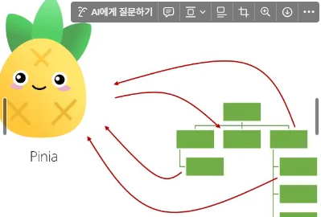
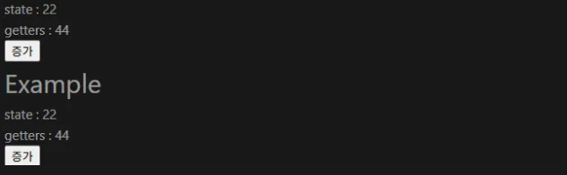
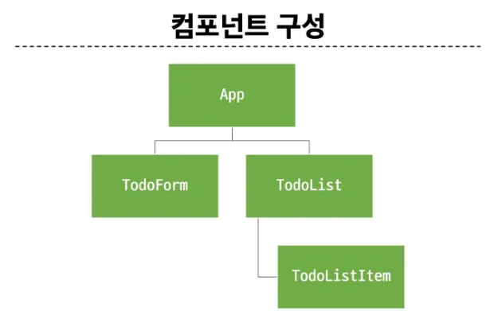
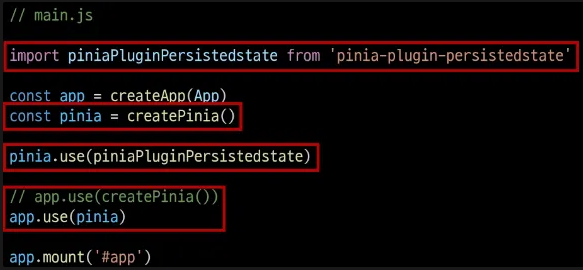

# State Management, pinia
- PJT에서 공통적으로 관리해야할 데이터를 관리.
- project를 생성할 때 pinia를 check하여 함께 설치.



## pinia structre
```js
// @/stores/counter.js
import {ref, computed } from 'vue'
import {defineStore } from 'pinia'

export const useCounterStore = defineStore('counter', () => {
    const count = ref(0)
    const doubleCount = computed(() => count.value * 2)
    function increment() {
        count.value++
    }
    
    return { count, doubleCount, increment }
})
```

### state, `ref`
- `const count = ref(0)`

### getters, `computed`
- `const doubleCount = computed(() => count.value * 2)`

### actions, `function`
```js
function increment() {
    count.value++
}
```

### plugin
- App 상태 관리에 필요한 추가 기능을 제공, 확장하는 도구나 모듈.
- App의 상태 관리를 더욱 간편하고 유연하게 만들어주면 패키지 매니저로 설치 이후 별도 설정을 통해 추가.

## Basic Practice
### `counter.js`
- export를 통해 다른 파일에서 import할 수 있는 값들을 명시.
```js
import { ref, computed } from 'vue'
import { defineStore } from 'pinia'

export const useCounterStore = defineStore('counter', () => {
    const count = ref(0)
    const doubleCount = computed(() => count.value * 2)
    function increment() {
        count.value++
    }

    return { count, doubleCount, increment }
})
```

### `App.vue`
- `store.count`는 ref 변수이지만, `.value` 속성으로 접근하지 않는다.
- `store.count`와 같은 state의 변경은 `store.count += 1`과 같이 작성해서는 안되고, `counter.js`에 관련 action을 정의하여 실행한다.
- `import { useCounterStore } from "@/stores/counter.js";`를 통해 import 수행.

```js
<template>
  <div>
    <p>state : {{ store.count }}</p>
    <p>getters : {{ store.doubleCount }}</p>
    <button @click="store.increment">증가</button>
    <example/>
  </div>

  
</template>

<script setup>
  import { useCounterStore } from "@/stores/counter.js";
  import example from "@/components/example.vue"
  const store = useCounterStore()
  console.log(store.count)
</script>

<style scoped>

</style>
```

### `example.vue`
- pinia의 데이터 동기화를 확인하기 위한 component.
```js
<template>
  <div>
    <h1>Example</h1>
    <p>state : {{ store.count }}</p>
    <p>getters : {{ store.doubleCount }}</p>
    <button @click="store.increment">증가</button>
  </div>
</template>

<script setup>
  import { useCounterStore } from "@/stores/counter.js";
  const store = useCounterStore()
</script>

<style scoped></style>
```

### result
- `exmaple.vue`의 버튼을 눌러도 `App.vue`의 값도 함께 증가한다.
- state가 공유되기 때문.



## Todo CRUD
- component 구조를 명확하게 그리고, 해당 내용을 바탕으로 FE 프로젝트를 진행.
- props, emits를 사용하지 않는 것이 아니라, 필요한 경우에는 사용하기.
  - 효율성 측면에서 고민.




## Local Todo
- 새로 고침을 수행하면 기존의 정보가 모두 없어진다.
- Local 영역에서 브라우저가 기억할 수 있도록 하는 방법.

1. npm install
```bash
npm install pinia-plugin-persistedstate
```

2. main.js 수정




3. `{persist : true}` 객체를 `defineStore` 함수의 세 번째 인자로 전달.
```js
export const useCounterStore = defineStore('counter' () => {
    ...
}, {persist: true})
```

# ETC
## `@` : src
- vite project 관련 설정들이 저장되어 있는 js 파일.
- alias 설정에 `@`가 작성되어 있음을 확인할 수 있다.
```js
// vite.config.js
...
export default defineConfig({
  plugins: [
    vue(),
    vueDevTools(),
  ],
  resolve: {
    alias: {
      '@': fileURLToPath(new URL('./src', import.meta.url))
    },
  },
})
```